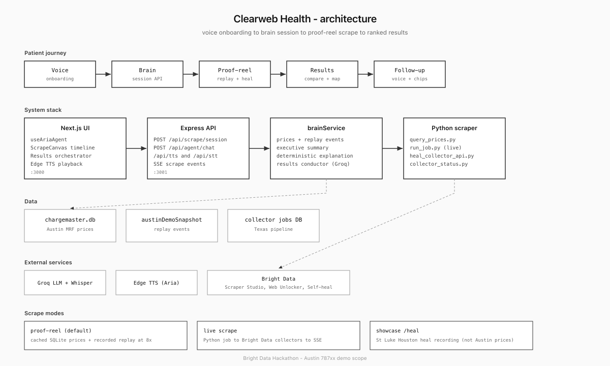

# Clearweb Health

Hospital prices are public in the United States. Every facility has to publish a CMS machine readable file with chargemaster rows. The problem is that nobody shops from those files. They are huge, buried behind hospital portals, and formatted differently at every site.

Clearweb Health is a patient facing app built for the [Scrapeverse](https://wemakedevs.org) hackathon (sponsored by Bright Data). You talk to **Aria**, a voice agent. You say what procedure you need, your insurance, and your ZIP code. The app scrapes real price files, matches rows to your payer and CPT code, and shows ranked hospitals near you with a replay of what the scraper actually did.

Coverage today is honest: **Austin metro (787xx ZIPs), 12 hospitals with verified prices**. Texas statewide collector work is in progress and shown separately on `/showcase/heal`. We label cached vs live data and show Bright Data collector IDs in the trust panel.

**[Watch the v1 demo (MP4)](docs/demo/clearweb-v1-demo.mp4)**

## The problem

A patient who needs an MRI or ER visit should be able to compare cash and in network prices at nearby hospitals before they book. CMS requires hospitals to publish standard charges, but the files live on price transparency pages with popups, redirects, and bot protection. A single HCA facility file can be close to a gigabyte. Comparing across hospitals means building collectors per health system, downloading files, parsing payer columns, and matching CPT codes.

Clearweb Health puts that pipeline behind a conversation instead of a spreadsheet.

## How it works

```
Voice onboarding (Aria)
       │
       ▼
POST /api/scrape/session  ──►  brainService bundles prices + replay + explanation
       │
       ├── SQLite cache hit?  → ranked results from chargemaster.db
       │
       └── cache miss?        → Python run_job.py
                                    │
                                    ├── Scraper Studio collectors (portal → MRF URL)
                                    ├── Web Unlocker (download when blocked)
                                    ├── Self-heal on collector failure
                                    └── match_engine.py (payer + CPT → price)
       │
       ▼
Proof-reel replay on ScrapeCanvas  →  Results with Aria walkthrough
```

### Patient journey

1. **Onboarding.** Aria asks for procedure, insurance, and ZIP through voice or chips. Coverage facts explain Austin scope before you scrape.
2. **Scrape.** The proof reel plays recorded events at 8x speed (default demo) or a live Python job runs locally. You see map nodes, MRF download phases, cache hits, failures, and self heal moments.
3. **Results.** Hospitals rank by price, distance, and your stated priorities. Expand a facility for cash vs insurance breakdown, photos, and booking actions. Aria can open charts, compare options, or show the trust panel.
4. **Trust panel.** Every hospital ties to a Bright Data collector ID (`c_mt…`). Self heal events from the replay are listed with timestamps.

### Bright Data integration

| Product | Role in this project |
|---------|---------------------|
| **Scraper Studio** | Per hospital system collectors that navigate price transparency portals and return MRF URLs. Templates live in `scraper/studio/` for HCA, Ascension, and Baylor Scott & White. |
| **Web Unlocker** | Downloads MRF bytes when direct HTTP is blocked or redirected. |
| **Self healing** | When a collector breaks after a site change, `heal_collector` refactors the template. St. Luke's Houston heal is recorded on `/showcase/heal` with the honest preview gate outcome. |

## Repository layout

```
frontend/     Next.js 14, Aria voice UI, ScrapeCanvas, results stage
backend/      Express API, brain session, TTS/STT, scrape job spawn
scraper/      Python: Bright Data collectors, heal loop, match engine, SQLite
docs/         Demo scripts, deploy notes, architecture diagram
scripts/      Local dev helpers, collector setup, progress hook
```

### Key files

| Path | What it does |
|------|----------------|
| `frontend/src/components/PatientView.tsx` | Onboarding → scrape → results phase machine |
| `frontend/src/components/ScrapeCanvas.tsx` | Live graph and proof reel timeline |
| `frontend/src/components/DynamicHospitalStage.tsx` | Expandable hospital rows with price breakdown |
| `frontend/src/hooks/useAriaAgent.ts` | Voice agent, STT/TTS, UI action tags |
| `frontend/src/data/austinDemoSnapshot.json` | Committed Austin prices + 66 event replay |
| `backend/services/brainService.js` | Single session API: prices, replay, conductor steps |
| `scraper/run_job.py` | Main scrape job with event logging |
| `scraper/match_engine.py` | Payer and CPT matching against MRF rows |
| `scraper/collectors/brightdata.py` | Scraper Studio CLI wrappers + Web Unlocker |
| `scraper/pipeline/heal.py` | Collector self heal and validation gate |
| `JUDGE.md` | Honest demo script, ZIP coverage, E2E checklist |

## Run locally

The default demo works with **frontend + backend only**. Cached Austin prices and the proof reel do not need Python running.

### 1. Backend (port 3001)

```bash
cd backend
npm install
cp .env.example .env   # add GROQ_API_KEY, optional BRIGHT_DATA_API_TOKEN
npm run dev
```

### 2. Frontend (port 3000)

```bash
cd frontend
npm install
cp .env.example .env.local
# NEXT_PUBLIC_BACKEND_URL=http://localhost:3001
npm run dev
```

Open http://localhost:3000. Say a procedure, **Aetna**, and ZIP **78701** or **78704**.

Useful flags in `frontend/.env.local`:

```ini
NEXT_PUBLIC_AGENTIC_RESULTS=true
NEXT_PUBLIC_SKIP_ONBOARDING=false
NEXT_PUBLIC_BACKEND_URL=http://localhost:3001
```

### 3. Scraper (live jobs only)

```bash
cd scraper
python -m venv .venv
source .venv/bin/activate
pip install -r requirements.txt
cp .env.example .env   # BRIGHTDATA_API_KEY, unlocker zone
```

Live scrape spawns from the results page when ZIP has no cache. Requires local Python and a Bright Data token. Not available on Vercel free tier.

## Environment variables

Keep secrets in `.env` files. Never commit them.

**Backend** (`backend/.env`):

- `GROQ_API_KEY` for Aria chat and optional Groq TTS
- `BRIGHT_DATA_API_TOKEN` for live scrape spawn and collector heal API
- `AGENTIC_RESULTS=true` to enable LLM results conductor
- `TTS_VOICE`, `WEBCMD_BRIDGE_SECRET` as needed

**Scraper** (`scraper/.env`):

- `BRIGHTDATA_API_KEY` (same Bright Data account)
- `BRIGHTDATA_UNLOCKER_ZONE` for Web Unlocker downloads
- `MRF_SAMPLE_MB` to range download large files during iteration

**Frontend** (`frontend/.env.local`):

- `NEXT_PUBLIC_BACKEND_URL`
- `NEXT_PUBLIC_AGENTIC_RESULTS`
- `NEXT_PUBLIC_SKIP_ONBOARDING` to jump straight to demo flow

See `backend/.env.example`, `scraper/.env.example`, and `docs/DEPLOY.md` for Render + Vercel setup.

## Demo paths

| URL | Purpose |
|-----|---------|
| `/` | Full patient journey |
| `/showcase/heal` | Recorded St. Luke's Houston self heal + Texas collector counts |

Recommended demo ZIPs: **78701**, **78704**. Do not demo with Houston (77002) or Dallas (75201) ZIPs; no price cache there yet.

Full judge script: [JUDGE.md](JUDGE.md)

## Architecture



Voice uses Groq for chat and Edge TTS for Aria speech. One API call (`POST /api/scrape/session`) returns prices, scrape replay events, and the results walkthrough steps. The frontend `usePresentationOrchestrator` plays conductor steps with TTS sync.

Self heal events (`heal_triggered`, `heal_resumed`, `extraction_failed`) are logged in the Python pipeline and replayed on the ScrapeCanvas so users see failures and fixes, not a fake progress bar.

## Hackathon context

Built for **Scrapeverse** to show that hospital price transparency data is scrapable at scale with Bright Data, and that patients deserve to see where those numbers came from.

## Status

Hackathon submission. Austin metro prices are verified. Texas statewide ingestion and live scrape hardening are next. Feedback welcome.
